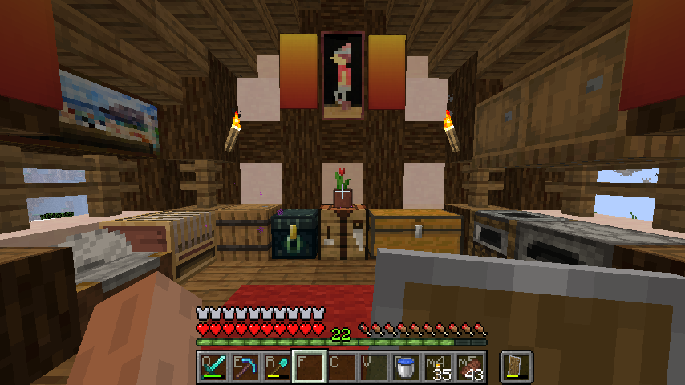

# mc-texture-binds

`texture_binds.py` is a script for overlaying keybinds onto the various 
inventory textures in Minecraft. This could be useful for players who have 
non-standard keybinds for their hotbar. Just clone the repo folder into 
your `.minecraft/resourcepacks/` folder and run the script.

# Usage
```
usage: texture_binds.py [-h] [--opacity float] [--offset int int]
                        [--version MINECRAFT_VERSION]
                        KEY KEY KEY KEY KEY KEY KEY KEY KEY

positional arguments:
  KEY

optional arguments:
  -h, --help            show this help message and exit
  --opacity float       set the opacity of the labels
  --offset int int      how offset the labels are from the corner
  --version MINECRAFT_VERSION
```
Heres an example:
```
$ python3 texture_binds.py Q E R F C V B m4 m5 --opacity 0.5 --offset 7 7 --version 1.14.4
```
# Requirements
* Python>=3.6
* [Pillow](https://python-pillow.org/) from `pip`
